# Cruel Season Cards Style Guide

These cards are focusing on a tarot style with some art nouveau inspiration in the framing. All cards will be using a consistent frame (provided below) with interchangeable symbols in the bottom right corner. 

## Colors

Cards must use colors only from our set color palette. Each card is allowed one accent color matching its category symbol.

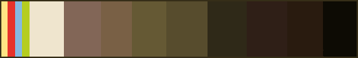
///caption
Allowed colors
///

## Frame

All cards use the same frame, but color variations are allowed per-card. We've provided some frame variations here. Art developers on our discord will also have the full frame .psd file available within the dev channels.

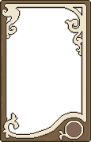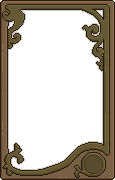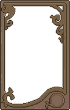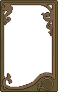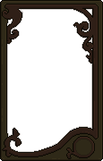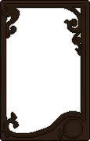

The symbol for the bottom right circle indicates the category of the card: butterfly for Environment, blood for Danger, star for Origin, and clan head for Behavior. 

The above symbol images are transparent with correct sizing to layer atop the provided frames without any extra work from you. They are also provided within the aforementioned full frame .psd file.

## Inner Art

Now for the meat of the work. It's recommended to first draw the inner art, the choose a final frame variation that best supports the color distribution of the inner art.

This art is what will truly represent the card. We're looking for strong silhouettes, repeating patterns and motifs, and a semi-realistic cat style.

!!! important
    I implore you to work *with* not *against* the pixels for this art style. Don't be afraid to let the pixel art have the straight angles it tends towards. Allow the interplay of angles and curves to flourish here.

### Subject Matter

We'll be allowing a certain level of stylized blood for these cards, but please don't edge far into gore territory. We shouldn't be showing detailed organs or graphic injury. 

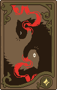
///caption
This is an exceptable depiction of blood/injury. Note that no torn skin or exposed bone/organ is displayed. It's clear injury is taking place, but the blood is stylized.
///

!!! tip
    To be clear, bones are still allowed! They only become an issue when it's a question of gore. Something like a broken bone sticking out of a wound wouldn't be accepted. Something like a clean cat skull *would* be accepted.

Beyond those restrictions, I encourage you to get creative! Have fun with symbolism, mirroring, and negative space. These are meant to really lean into symbolism, so don't be afraid to break with reality.

### Strong Silhouettes

The focus of the style and composition should be on creating strong shapes and silhouettes. Your art should be mostly **lineless**.

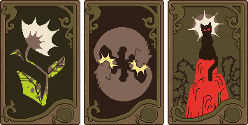
///caption
All of these cards are mostly lineless except for some details. The first allows lines for the veins of the leaves. The second allows lines for the details of the cat heads. The third allows lines for details of the rock.
///

Shading isn't a priority, nor encouraged, here. Rather, work to find silhouettes that provide all the information they need to without any additional shading.

### Patterns and Motifs

A feature of tarot card decks is the inclusion of common motifs. Look through any tarot deck, and you'll see repeated elements throughout the deck as a whole. We want to include similar theming in our cards.

#### Established Motifs

Motifs we already utilize in our existing cards are the following:

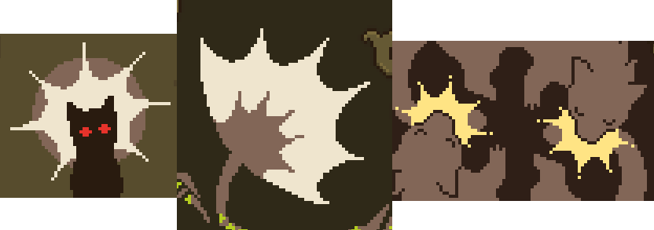
///caption
Starbursts are a fun shape to scatter about. They can be used as the head of a flower, the impact of a bite, or the crown of a tyrant. It's a broadly applicable shape and is suitable for many designs.
///

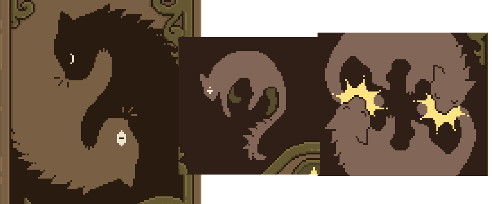
///caption
Each of these cats features similar fur spikes. Note the repetitive patterning. We make no effort to vary the fur in a "random" manner. The point is the stylized and repetitive nature of them.
///

It's encouraged for you to look to include these motifs in your own card designs, to help unify all the cards as a whole.

!!! important
    You're welcome to introduce new motifs! Motifs work best when they have a very defined, but broadly applicable, shape (like the starburst); or have a very narrow, but common, use (such as the cat fur spikes).

### Cat Proportions

Our cats should feature semi-realistic proportions, similar to the proportions we keep for Patrol Art. Keep them stylized, but not cartoony.

- Eyes should be especially stylized. They can make for good imagery, lean into that. The examples already shown in this guide should have given you a good look at how eyes are currently being stylized. 
- Any excess fluff should utilize the fur spike motif discussed prior.
- Mouth and nose should generally be kept undrawn, unless the design itself centers around the cat's mouth/face.
- Anatomical proportions can be pulled and squished in the pursuit of stylization. Remember that realism isn't the goal of these cards. Above all, we are focusing on symbolism and imagery. Rules can be broken if it lends to more pleasing stylization.
